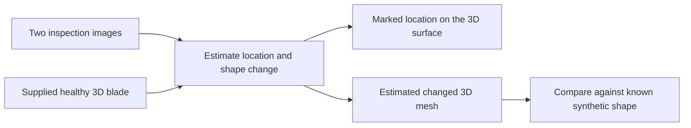

# Jet Blade 3D

**Can inspection images tell us where a blade changed—and estimate the actual change in its 3D shape?**

This is the current research direction. We supply images and a healthy 3D blade; we want a location on the surface and an estimated damaged mesh.

**[Open Jet Blade 3D](https://afeefaaazam03.github.io/MyPortfolio/jet-blade-3d/)** · [Run locally](DEMO_README.md) · [Results PDF](evidence/Joint_Appearance_Geometry_Results.pdf) · [Two-minute presentation](DEMO_SCRIPT.md)

Published as a separate research page in [MyPortfolio](https://github.com/afeefaaazam03/MyPortfolio/tree/main/jet-blade-3d). The original Main Jet page remains available as the broader earlier presentation.

## What goes in and what comes out?

| | In plain language |
| --- | --- |
| Input | Two blade images, a supplied healthy 3D mesh, and known camera/lighting information. |
| Current method | Fit a restricted dent and an optional color patch. Three possible dent locations are supplied. This latest comparison is **nonlearned**. |
| Output | A fitted 3D location and saved movements of the mesh vertices. Adding those movements to the healthy mesh produces the estimated changed mesh. |
| Check | Compare the output with a known synthetic damaged shape, kept separate from the fitting inputs. |

Yes, **we locate on 3D and the shape output is also 3D**. These are related tasks: locating the correct point does not establish the correct dent depth or full shape.

## What is done, unfinished, and planned?

| Completed | Still needs work | Planned next |
| --- | --- | --- |
| Controlled synthetic blade cases and rendered inputs | Reliable damage depth and affected area | Directly render fitted meshes/materials to investigate depth errors |
| Image-to-known-surface localization experiments | Separating shape from color and lighting | Improve the estimator using that diagnosis |
| Saved changed-mesh predictions and quantitative checks | Damage outside three supplied locations; uncertain cameras; unfamiliar blades | Freeze the improved method, then test untouched examples |
| Interactive replay and complete result tables | Verified accuracy on measured real damage | Real-image / measured-3D validation when suitable public data is available |

There is no meaningful “percent complete” for the research goal. The latest batch is finished; the next experiment is planned, not running. The full goal has **not** been achieved.

## What the latest experiment actually found

The demo contains **all 68 controlled cases from two already exposed public source geometries**: 18 dents, 12 color-only changes, 36 mixtures, and 2 healthy controls. These are not 68 independent blades and not real damage scans.

Compared with a shape-only fit using the same two inputs, separating shape and color:

- Reduced mean false-displacement RMS on color-only cases by **99.8%**.
- Increased mean local 3D RMS error on mixed cases by **26.8%**, with **30 of 36 worse**.

These are changes in error, not accuracy percentages. Local error is evaluated on exactly changed blade-surface vertices. Correct selection among three known locations and improved image agreement are not proof of accurate 3D reconstruction. The newer method has not been promoted as a successful replacement.

## Try it

1. Run the six-slide presentation and demo locally using [DEMO_README.md](DEMO_README.md).
2. Rotate the estimated blade; switch between healthy, estimate, and known answer.
3. Compare “Shape + color fit” with “Shape-only fit.” Try a color-only case too.
4. Inspect the saved mesh coordinates and errors, or play the 60-second walkthrough.

This is a working **viewer of actual saved experimental outputs**, not live model inference or a video pretending to run a model. All vertices and triangles are displayed. The interpolation slider does not exaggerate deformation. Teal/orange highlights show displacement above a fixed threshold, not learned confidence.

## Data, evidence, and limits

The public [PLAID Rotor37](https://huggingface.co/datasets/PLAID-datasets/Rotor37) meshes are licensed CC BY-SA 4.0. Dents, color changes, and inspection images are synthetic. No confidential industrial data is included.

- [Sources, exact revision, transformations and attribution](SOURCE_DATA.md)
- [What is implemented, simulated, and future work](DEMO_LIMITATIONS.md)
- [All 272 method/case metric records](assets/data/all_results.csv)
- [Scientific asset hashes](assets/data/asset_manifest.json) and [verification summary](assets/data/verification_summary.json)
- [Data schema](assets/data/SCHEMA.md) and [accepted results PDF](evidence/Joint_Appearance_Geometry_Results.pdf)

Earlier learned-model and surface-localization studies are part of the wider project. This repository tells that research story, then embeds the latest 3D fitting comparison as one diagnostic experiment. The earlier learned results and the latest nonlearned fit are clearly separated; they are not one finished end-to-end trained system.

The demo code is MIT licensed. Derivative geometry and image assets are CC BY-SA 4.0; see [LICENSE.md](LICENSE.md). Research status: **23 September 2026**.

The chapter layout follows the existing Main Jet research presentation: visual overview, data, input/output, completed work, interactive experiment, research plan, and a final concept of the intended inspection record. [Simple research overview](PROJECT_OVERVIEW.html) · [Overview PDF](JET_BLADE_3D_OVERVIEW.pdf).
